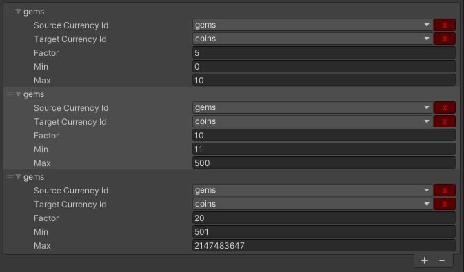

[](https://openupm.com/packages/com.fredericrp.playercurrency/)

# Player Currency

An easy to setup in game currency manager.

It uses the ```PersistentDataSystem``` to load and save data.

## Usage

Call the ```PlayerCurrencyManager``` to get or add virtual currency amount to your players.

Each currency has its own unique string identifier, we advise you to include it in a list as it's shown in the GameQuest sample. By default, the tool will use ```CurrencyList.txt``` as the data list.

### Retrieve the currency amount the player has

```C#
int playerGoldAmount = PlayerCurrencyManager.Instance.GetCurrencyCount("gold");
```

### Add a certain amount of currency to the player

```C#
PlayerCurrencyManager.Instance.AddToCurrency("gold", 500);
```

The currency is protected to prevent going below 0.

## Advanced - Money conversion

It contains a conversion system to allow you creating multiple conversion between virtual currencies (used in general as In App Purchases).



```C#
int coinAmount = PlayerCurrencyManager.Instance.GetConvertedCurrency(50, "gems", "coins");
```

In this case, ```coinAmount``` equals 500.


